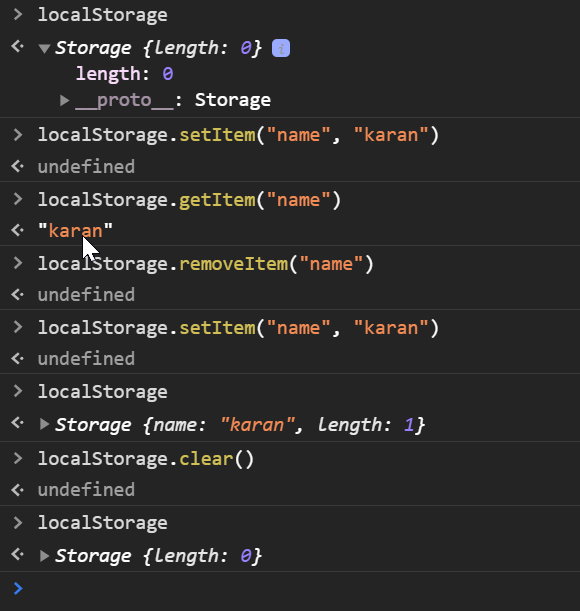

# Local Global Web Storage

Web Storage is the data stored in user's browser. 

There are two types of Web Storage

### 1. Local Storage
Data with no expireation date that will persist after the browser window is closed.

### 2. Session Storage
Data that gets cleared after the browser window is closed.

Previously <b>Cookies</b> were the only option for stroing local data. Now Localstorage provides a much better alternative. Local Storage has higher limit of storage(5MB vs 4KB) and doesn't get sent with every HTTP Request.

## Local Storage Methods

1. setItem(): Add a (key, value) pair to local storage
2. getItem(): Retrieve a value by the Key
3. removeItem(): Remove an item by Key
4. clear(): Clear all storage

